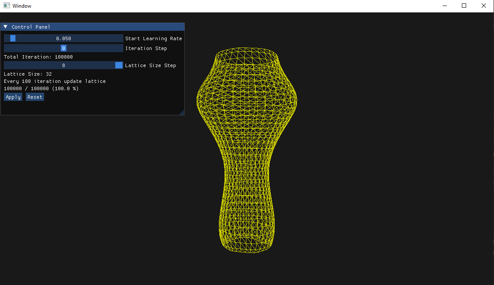

# PREREQUISITES
- vcpkg
- cmake
- set environment variable VCPKG_FEATURE_FLAGS=manifests  

# Self Organizing Map
00957016 高敬庭

## 完成功能
+ 實作一個圓柱體的2D lattice
+ 利用SOM演算法將lattice fitting到3D資料(vase)上  

## 結果圖
